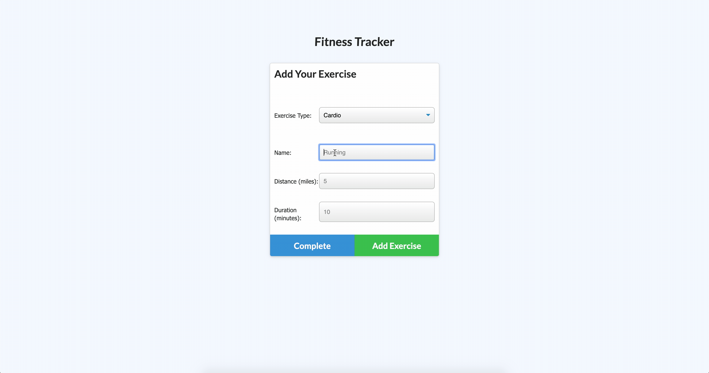

# JT Turner Workout Tracker

##Description
This application allows the user to create, save, and track their previous workouts. The user can choose between cardio or resistance based training, name the workout, and enter details about the workout such as the duration or distance.

##Screenshots of Completed Application

##Links to Deployed Application
Github Pages: https://github.com/javierturner/workouttracker
Deployed App: https://desolate-shelf-41461.herokuapp.com/

##How to Use
There is no installation required for this application. Just go to https://desolate-shelf-41461.herokuapp.com/ and click "New Workout." Then, continue to enter your workout details and click "Add Workout," and you're done!

##License

MIT License

Copyright (c) 2019 Javier Turner

Permission is hereby granted, free of charge, to any person obtaining a copy
of this software and associated documentation files (the "Software"), to deal
in the Software without restriction, including without limitation the rights
to use, copy, modify, merge, publish, distribute, sublicense, and/or sell
copies of the Software, and to permit persons to whom the Software is
furnished to do so, subject to the following conditions:

The above copyright notice and this permission notice shall be included in all
copies or substantial portions of the Software.

THE SOFTWARE IS PROVIDED "AS IS", WITHOUT WARRANTY OF ANY KIND, EXPRESS OR
IMPLIED, INCLUDING BUT NOT LIMITED TO THE WARRANTIES OF MERCHANTABILITY,
FITNESS FOR A PARTICULAR PURPOSE AND NONINFRINGEMENT. IN NO EVENT SHALL THE
AUTHORS OR COPYRIGHT HOLDERS BE LIABLE FOR ANY CLAIM, DAMAGES OR OTHER
LIABILITY, WHETHER IN AN ACTION OF CONTRACT, TORT OR OTHERWISE, ARISING FROM,
OUT OF OR IN CONNECTION WITH THE SOFTWARE OR THE USE OR OTHER DEALINGS IN THE
SOFTWARE.